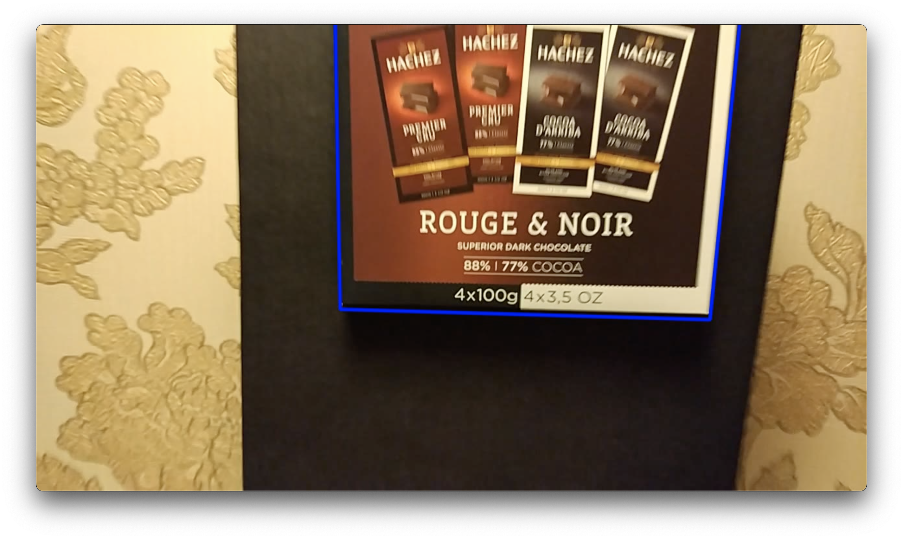

# Homography Detection

Task from the **IT-Jim Computer Vision course**.

Goal: detect a planar marker in each video frame using ORB feature matching, estimate homography, and draw the projected marker region.

## Files

- `Homography.ipynb` - main notebook solution
- `ORB_Homography.avi` - output homography video

## Input -> output example

(Video will be added later)

| Item | Example |
| --- | --- |
| Marker (input image) |  |
| Input video | [`../source/find_chocolate.mp4`](../source/find_chocolate.mp4) |
| Output video | [`ORB_Homography.avi`](ORB_Homography.avi) |

### Result preview

## Pipeline summary

1. Load marker image and source video.
2. Detect ORB keypoints/descriptors on marker and current frame.
3. Match descriptors with BFMatcher (`NORM_HAMMING`, `crossCheck=True`).
4. Filter matches by distance threshold.
5. Estimate homography with `cv2.findHomography(..., cv2.RANSAC, ...)`.
6. Project marker corners via `cv2.perspectiveTransform` and draw polygon.
7. Save processed frames to output video.

## Run

Open and run `Homography.ipynb` from this folder.  
The notebook uses:

- `../source/marker.jpg`
- `../source/find_chocolate.mp4`

